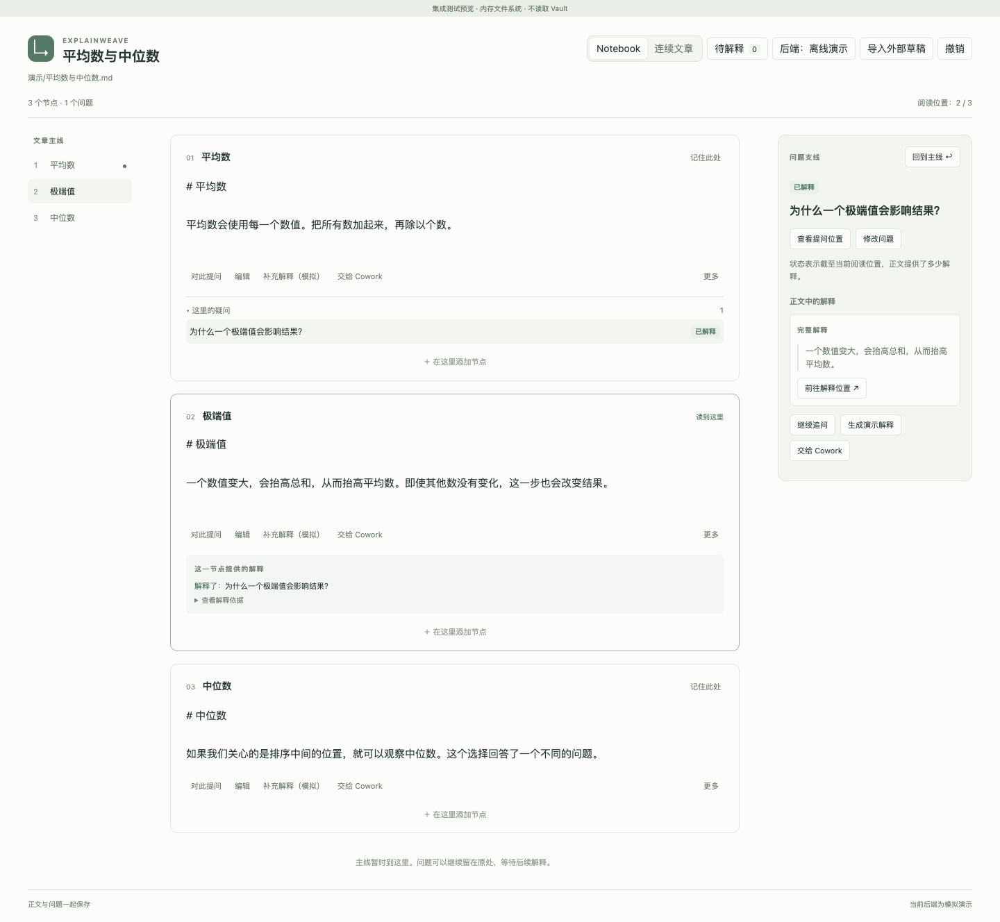

# ExplainWeave

An Obsidian-first notebook for connected explanations, in-place questions, and AI-assisted writing.

把文章、疑问与后续解释组织在同一条阅读路径里。



ExplainWeave 希望让写作和阅读保持连续：读到某段产生疑问时，可以就地记录、展开追问，再回到原来的位置；写作时可以在两段之间补充必要的背景和推导。后续节点可以关联它解释了哪些先前的问题，文章修改后，这些关系也随之更新。

## 当前状态

已有可构建的 **0.1.0 开发预览版**：Notebook 与连续文章视图、节点编辑、就地问题与追问、带证据的解释关联、阅读位置、撤销、草稿持久化和冲突恢复。

DeepSeek / Claude API 的流式适配器及 Cowork 任务交接已实现。默认使用离线演示；真实 API 凭据调用、Cowork 客户端交接和 Obsidian 原生渲染仍待应用内验证。Codex 运行时、AI 自动判断解释覆盖和完整的增量上下文策略尚未实现。不要把已通过的协议或浏览器测试当作这些验证已完成。

- 产品名：**ExplainWeave**
- GitHub：[Hanskrrr/ExplainWeave](https://github.com/Hanskrrr/ExplainWeave)
- 首个运行环境：Obsidian 桌面端，先在 macOS 开发环境验证
- 运行要求：Obsidian 桌面端 1.12+；开发环境 Node.js 24+、pnpm 11.19

## 核心体验

1. 在普通 Markdown 文章与 Notebook 式节点视图之间切换。
2. 选中一段文字添加疑问，先记录也可以，不要求立即调用 AI。
3. 就地展开回答与追问，保留主线阅读位置。
4. 在节点之间生成补充解释，预览后插入正文，或保留为旁注。
5. 显示“本节解释了哪些先前问题”和“截至这里仍有哪些问题未解释”。
6. 调整节点后，重算解释关系并指出需要检查的衔接。

“已解释”描述的是正文的解释覆盖：它必须指向具体回答段落，并且与阅读路线、正文版本有关。它不表示读者已经理解，也不要求读者勾选“我懂了”。

## 产品形态

首版为 **Obsidian 插件 + 独立于 Obsidian 的文档核心 + 可替换的 AI 适配器**。直接打开 Vault 中的文章；已有 AI 回答可先通过粘贴 Markdown 导入。可复用核心为未来独立应用留下空间。

AI 接入区分三类：直接调用模型、运行可编程 Agent、向已有客户端交接任务。DeepSeek、Claude API、Codex 和 Claude Cowork 不会被伪装成能力完全相同的一个聊天接口。

## 文档

- [产品规则与首版体验](docs/product.md)
- [架构与数据一致性](docs/architecture.md)
- [AI 接入方式与已核实边界](docs/integrations.md)
- [开发顺序与验收标准](docs/roadmap.md)

开发和验证先使用独立测试 Vault。功能通过验证后，再提供安装包供真实文章试用。

## 构建与试用

```sh
pnpm install --frozen-lockfile
pnpm check
pnpm dev:vault
```

在 Obsidian 中把项目的 `dev-vault/` 作为一个独立 Vault 打开。打开示例文章，运行命令 **ExplainWeave: 打开解释笔记**。首次使用会预览隐藏节点标记；确认转换后才写入文件。测试 Vault 的插件文件由 `pnpm dev:vault` 从本次构建复制，每次更新后需要重新复制并在 Obsidian 中重新加载插件。

手动安装时，将 `dist/explainweave/` 内的 `main.js`、`manifest.json`、`styles.css` 放入测试 Vault 的 `.obsidian/plugins/explainweave/`，再启用插件。

点击笔记顶部的后端按钮，或运行 **ExplainWeave: 设置 AI 后端**，可以选择 DeepSeek / Claude API。填写自己账号可用的模型 ID；密钥只在当前 Obsidian 会话保留，重启后需重新填写。当前生成会发送文章正文与附属问题（包括追问关系）；生成结果先进入草稿，不直接替换正文，也不自动宣称问题已解释。

“交给 Cowork”会导出独立任务包并请求打开 Claude 客户端。任务需在客户端发送；完成后用“导入外部草稿”选择 `return.json`。正式采用前会核对原文版本。该功能需要支持相应官方深链接的 Claude Desktop，尚未完成客户端实测。

## 验证

```sh
pnpm test
pnpm exec playwright install chromium
pnpm test:e2e
```

单元与集成测试覆盖源文保留、覆盖语义、撤销、保存中断、外部冲突、流式协议、取消和返回草稿校验；Chromium 测试覆盖宽窄布局与真实界面操作。详细状态和当前边界见 [实现状态](docs/status.md)。
