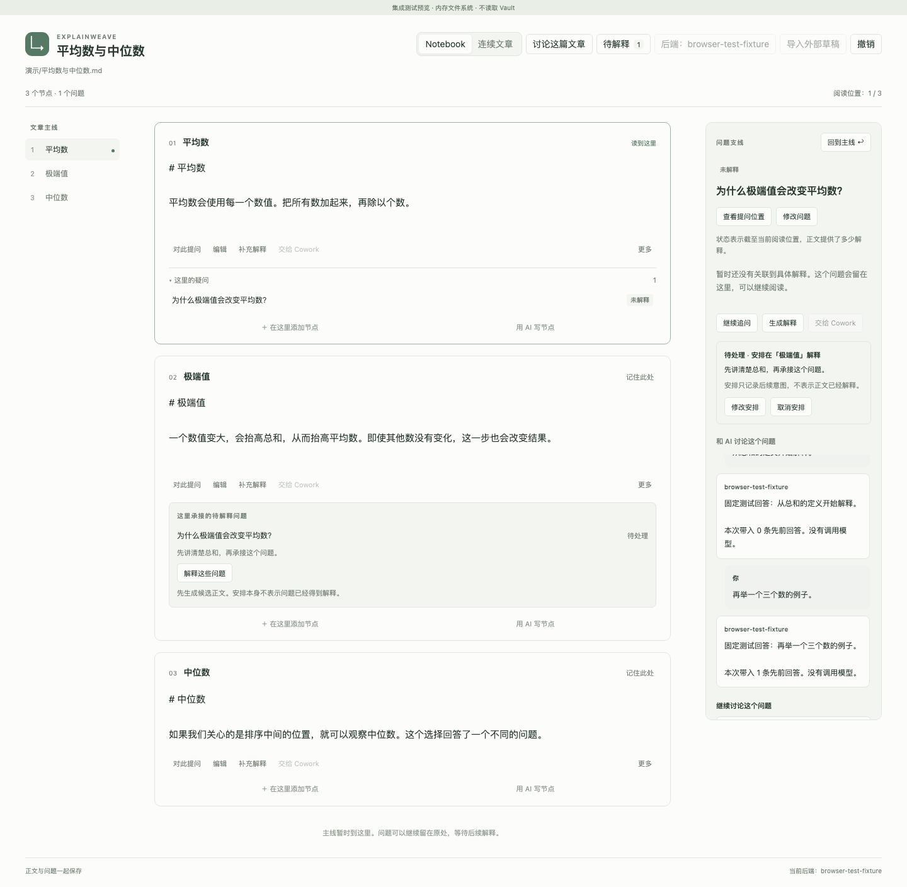

# ExplainWeave

An Obsidian-first notebook for connected explanations, in-place questions, and AI-assisted writing.

把文章、疑问与后续解释组织在同一条阅读路径里。



ExplainWeave 希望让写作和阅读保持连续：读到某段产生疑问时，可以就地记录、展开追问，再回到原来的位置；写作时可以在两段之间补充必要的背景和推导。后续节点可以关联它解释了哪些先前的问题，文章修改后，这些关系也随之更新。

## 当前状态

当前为 **0.2 开发预览**：在 Notebook 与连续文章视图中编辑节点、讨论整篇文章或某个问题、继承父问题讨论、安排后续解释，并把讨论整理成候选正文。聊天历史、安排、草稿和阅读位置可以恢复；采用候选正文时，正文与带引用依据的 AI 解释关联一起提交，也可以整组撤销。

DeepSeek / Claude API 的流式适配器及 Cowork 任务交接已实现，默认使用离线演示。追加上下文已接入模型请求：同一讨论保留已发送消息，文章变化以节点更新、删除记录和新顺序追加。真实 API 调用、Cowork 客户端交接和 Obsidian 原生环境仍未验证；Codex 运行时尚未接入，缓存收益也未实测。上方截图来自浏览器集成测试。

- 产品名：**ExplainWeave**
- GitHub：[Hanskrrr/ExplainWeave](https://github.com/Hanskrrr/ExplainWeave)
- 首个运行环境：Obsidian 桌面端，先在 macOS 开发环境验证
- 运行要求：Obsidian 桌面端 1.12+；开发环境 Node.js 24+、pnpm 11.19

## 核心体验

1. 在文章顶部点击 **讨论这篇文章**，输入消息并 **发送**；已有问答保留在同一讨论里。
2. 选中文字添加疑问，在 **和 AI 讨论这个问题** 中继续追问。子问题首次讨论继承父支线的历史，随后保留自己的讨论；展开继承记录可查看背景，再回到主线。
3. 暂时不展开的问题可点击 **安排在后续节点解释**，选择后面的节点并 **保存安排**。安排只表示写作意图，不会把问题标为已解释。
4. 讨论充分后点击 **整理成正文节点**、**生成正文草稿**；也可在节点处直接点击 **用 AI 写节点**。
5. 查看候选正文、解释了哪些问题及引用依据，再点击 **采用为后续解释**。正文和这次提出的解释关联一起写入；顶部 **撤销** 可一起撤回。
6. 在 **正文中的解释** 查看当前阅读位置已覆盖的问题；不合适的关系可 **移除关联**，再修改正文或重新关联。编辑、移动问题或回答后，需要复查的关系会显示待检查。

“已解释”描述的是当前阅读路线上的正文覆盖，不表示读者已经理解。AI 提出的关联必须带有候选正文中可定位的引用；引用和版本检查通过，只能证明它指向了这段文字，不能保证语义上回答充分。用户可以移除、修正这些关联；聊天中的回答和后续安排本身不计入正文覆盖。

## 产品形态

首版为 **Obsidian 插件 + 独立于 Obsidian 的文档核心 + 可替换的 AI 适配器**。直接打开 Vault 中的文章；已有 AI 回答可先通过粘贴 Markdown 导入。可复用核心为未来独立应用留下空间。

AI 接入区分三类：直接调用模型、运行可编程 Agent、向已有客户端交接任务。DeepSeek、Claude API、Codex 和 Claude Cowork 不会被伪装成能力完全相同的一个聊天接口。

## 文档

- [产品规则与首版体验](docs/product.md)
- [架构与数据一致性](docs/architecture.md)
- [AI 接入方式与已核实边界](docs/integrations.md)
- [开发顺序与验收标准](docs/roadmap.md)

开发和验证先使用独立测试 Vault。功能通过验证后，再提供安装包供真实文章试用。

## 构建与试用

```sh
pnpm install --frozen-lockfile
pnpm check
pnpm dev:vault
```

在 Obsidian 中把项目的 `dev-vault/` 作为一个独立 Vault 打开。打开示例文章，运行命令 **ExplainWeave: 打开解释笔记**。首次使用会预览隐藏节点标记；确认转换后才写入文件。测试 Vault 的插件文件由 `pnpm dev:vault` 从本次构建复制，每次更新后需要重新复制并在 Obsidian 中重新加载插件。

手动安装时，将 `dist/explainweave/` 内的 `main.js`、`manifest.json`、`styles.css` 放入测试 Vault 的 `.obsidian/plugins/explainweave/`，再启用插件。

点击笔记顶部的后端按钮，或运行 **ExplainWeave: 设置 AI 后端**，可以选择 DeepSeek / Claude API。填写自己账号可用的模型 ID；密钥只在当前 Obsidian 会话保留，重启后需重新填写。请求包含文章上下文、问题及相关讨论的完整历史，当前不会静默截断旧消息。中间编辑以增量追加，同一讨论保留已有消息前缀；本地大小限制与服务上下文窗口仍会限制长会话，超限报错并保留已有数据，不保证无限续聊或固定缓存收益。

正文保存在 `.md`，问题与解释关联保存在 `.explainweave.json`，二者通过可恢复的正文事务提交。`.explainweave.sessions.json` 保存讨论历史、后续安排和上下文日志；草稿另存于 `.explainweave.drafts.json`。这些旁文件各自检测外部冲突，但不存在覆盖全部文件的原子事务。备份时请同时保留伴随文件。

“交给 Cowork”会导出独立任务包并请求打开 Claude 客户端。任务需在客户端发送；完成后用“导入外部草稿”选择 `return.json`。正式采用前会核对原文版本。该功能需要支持相应官方深链接的 Claude Desktop，尚未完成客户端实测。

## 验证

```sh
pnpm test
pnpm exec playwright install chromium
pnpm test:e2e
```

单元与集成测试覆盖源文保留、覆盖语义、整组撤销、讨论恢复、保存中断、外部冲突、流式协议、取消和返回草稿校验；Chromium 测试覆盖宽窄布局与真实界面操作。测试结果见 CI / 本地验证；原生应用及真实服务边界见 [实现状态](docs/status.md)。
